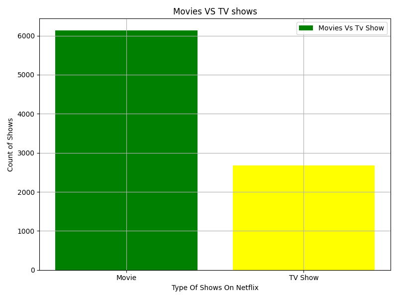

# Exploratory-Data-Analysis-of-Netflix-Content
A comprehensive data analysis and visualization project aimed at uncovering insights from the Netflix dataset. The primary goal was to explore the content library's composition, identify trends over time, and understand the distribution of content across various categories, ratings, and countries.

This project aims to answer several key questions about the Netflix content library, such as:
- What is the ratio of movies to TV shows?
- Which countries produce the most content?
- What are the most common content ratings?
- How has the volume of content changed over the years?
- What is the typical duration for movies on the platform?

## Technologies Used

- **Python 3.x:** The core programming language for the analysis.
- **Pandas:** Used for data manipulation, cleaning, and exploration.
- **Matplotlib:** Used for generating all static charts and plots.
- **Jupyter Notebook:** For interactive data exploration and analysis.

This will process the data and save all the generated visualizations as `.png` files in the `images` directory (or your specified output folder).

## Visualizations Showcase

Here are the key visualizations generated from the analysis:

**1. Content Type Distribution (Movies vs. TV Shows)**
*A bar chart showing the total count of movies and TV shows available on Netflix.*

**2. Top 10 Content Producing Countries**
*A horizontal bar chart displaying the countries that have produced the most content for Netflix.*

**3. Content Added Over the Years**
*A line chart illustrating the trend of content being added to the platform over time.*

**4. Distribution of Content Ratings**
*A pie chart showing the proportion of different content ratings.*

